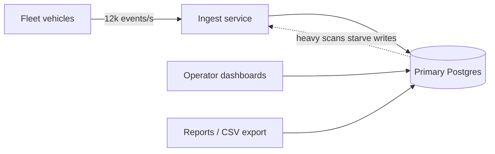
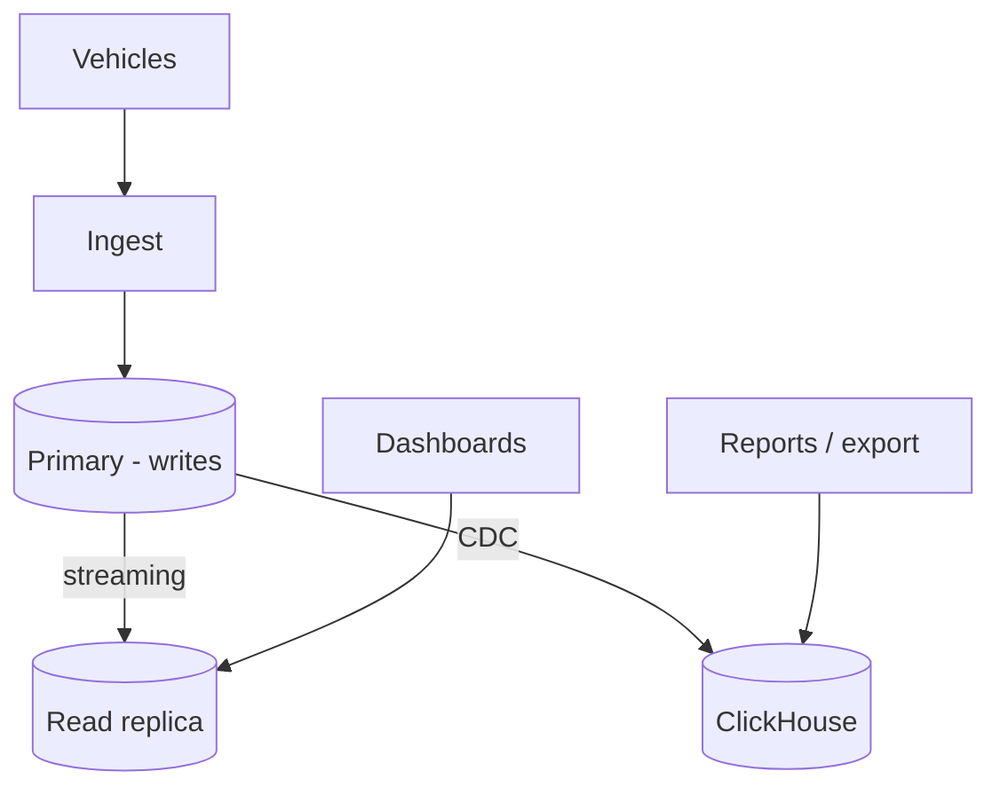
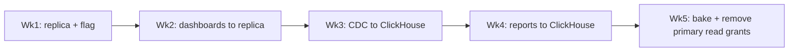

# ADR-073

## Split the telemetry read-path off the primary database

Tideglass · Platform Engineering review

Status: Proposed → Accepted · Reviewed 2026-05-08

---
layout: statement
---

## One database serves both the writes and the dashboards.

### At 10× fleet growth, that stops being a simplification and becomes the bottleneck.

---

## Context

Tideglass ingests telemetry from connected fleet vehicles — GPS, fuel, engine
diagnostics — and serves it back to operators as live dashboards and reports.

Today, **a single PostgreSQL primary** handles everything:

- **Writes** — ~12k telemetry events/sec, append-only into `vehicle_events`
- **Reads** — operator dashboards, fleet rollups, and ad-hoc CSV exports
- **One connection pool** shared between ingest and analytics

The fleet is contracted to grow **~10× over 18 months**. We are re-evaluating
before the growth, not after the incident.

---

## Current state — the pain

- Large dashboard scans **lock-contend** with the ingest write path
- p99 ingest latency spiked to **2.4s** during a customer's month-end export
- Vacuum can't keep up; table bloat on `vehicle_events` grows ~6%/week
- **One outage surface**: a bad analytics query can degrade ingest for everyone

---

## Forces & constraints

- **Write durability is non-negotiable** — telemetry is contractual; we cannot drop events.
- **Dashboards tolerate seconds of staleness** — operators read trends, not real-time control.
- **Small team (4 engineers)** — we cannot adopt a system that needs a dedicated DBA.
- **Budget** — current DB spend is $4.2k/mo; a 2× increase is acceptable, 5× is not.
- **Existing investment** — the team knows Postgres well; SQL reports are a selling point.

---
layout: two-cols
---

# Proposed change

::default::

Split **reads** off the write path:

1. Keep the **primary** for ingest writes only
2. Add a **read replica** for dashboards (seconds-stale is fine)
3. Route heavy **reports/exports** to a **columnar store** (ClickHouse),
   fed by CDC from the primary

::right::

The primary does one job. Each read class gets a store shaped for it.

---

## Alternatives considered

| Option | Summary | Why not (yet) |
|--------|---------|---------------|
| **A — Do nothing** | Vertically scale the primary | Buys ~6 months; doesn't fix read/write contention |
| **B — Read replica only** | Move dashboards off primary | Helps dashboards; exports still do full scans |
| **C — Replica + ClickHouse** ✓ | Isolate writes, dashboards, reports | More moving parts; CDC pipeline to operate |
| **D — Full event-sourcing rewrite** | Kafka + materialized views | Right long-term, wrong cost for a 4-person team now |

We chose **C**: it solves the contention without betting the team on a rewrite.

---

## Decision matrix

| Criterion | Weight | A: Scale up | B: Replica | C: Replica+CH | D: Rewrite |
|-----------|:------:|:-----------:|:----------:|:-------------:|:----------:|
| Removes contention | 0.30 | 1 | 3 | 5 | 5 |
| Operability (small team) | 0.25 | 5 | 4 | 3 | 1 |
| Cost fit | 0.20 | 3 | 4 | 4 | 2 |
| Scales to 10× | 0.15 | 1 | 2 | 5 | 5 |
| Time to ship | 0.10 | 5 | 4 | 3 | 1 |
| **Weighted** | | **2.6** | **3.4** | **4.2** | **3.1** |

Scores 1–5. **Option C wins at 4.2**, driven by contention removal and 10× headroom.

---

## Decision · Option C

> **We will split the telemetry read-path: a streaming read replica for
> dashboards, and a CDC-fed ClickHouse store for reports and exports.**
> The primary becomes write-only.

- **Status:** Accepted
- **Owner:** Platform Engineering
- **Rollout:** 5 weeks, behind a read-routing feature flag
- **Reversible:** dashboards can fail back to the primary by flipping the flag

---

## Consequences

**Positive**

- Ingest p99 isolated from analytics; no more export-induced write stalls
- Reports run on columnar storage — month-end export goes from ~90s to a target < 5s
- Clear scaling story: replicas scale dashboards, ClickHouse scales reports independently

**Negative / risks**

- **New CDC pipeline** to operate and monitor (replication lag is now a metric we own)
- **Eventual consistency** — dashboards may lag writes by seconds; must be made visible in the UI
- **+$1.9k/mo** infra for the replica + ClickHouse node (within the 2× budget)

---

## Mitigations & rollout

- **Lag alerting** — page if replication or CDC lag exceeds 30s
- **"Updated Ns ago" badge** on dashboards so staleness is honest, not hidden
- **Shadow reads** in week 4 — compare ClickHouse vs primary results before cutover
- **Kill switch** — feature flag routes all reads back to primary in one toggle

---

## Open questions

- Do we need **per-tenant CDC isolation**, or is one pipeline acceptable at 10×?
- Retention: keep raw events in the primary **30 or 90 days** before trimming to ClickHouse only?
- Should ad-hoc SQL exploration point at the **replica** or **ClickHouse**? (Leaning replica for familiarity.)

These are tracked as follow-ups; none block accepting the decision.

---
layout: center
class: text-center
---

# ADR-073 · Accepted

Tideglass · Platform Engineering · rollout begins next sprint

Supersedes ADR-051 (single-primary scaling) · re-review after week-5 bake

