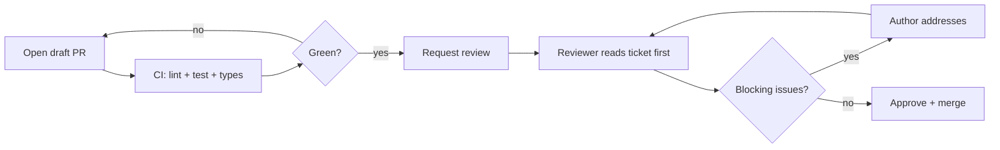

# Code Review at Meridian Labs

How the Compass team turns pull requests into shared understanding.

Engineering onboarding · Week 1

---
layout: statement
---

## Review is not a gate.

### It's the cheapest place we have to share context.

---

## Why we review

Every PR does four jobs — only one of them is "catch bugs":

- **Correctness** — does it do what the ticket says, including the edge cases?
- **Context** — a second engineer now understands this code path
- **Consistency** — the codebase stays one codebase, not forty dialects
- **Continuity** — the author isn't the only person who can touch it tomorrow

> If a review only ever finds bugs, the diff was too big to teach anything.

---

## The lifecycle of a Compass PR

Reviewers read the linked ticket **before** the diff. The diff answers
*how*; the ticket says *whether it should exist at all*.

---

## The reviewer's checklist

We keep it short enough to actually run every time:

1. **Does it match the ticket?** Scope creep gets its own PR.
2. **Tests** — is the new behavior pinned by a test that would fail without it?
3. **Failure paths** — what happens on timeout, empty list, null, retry?
4. **Naming & boundaries** — does this belong in this module?
5. **Reversibility** — can we roll this back without a data migration?
6. **Docs** — did a public contract change without a note?

If it passes all six, approve. Don't invent a seventh.

---
layout: two-cols
---

## Good comment

Specific, actionable, and explains the *why*.

> This `for` loop re-queries the DB per row — N+1 on the
> dashboard's hot path. Can we `select ... where id in (...)`
> and map in memory? Happy to pair if useful.

Names the problem, the impact, and offers a path forward.

::right::

## Nitpick

Subjective, blocks nothing, costs the author a round-trip.

> I'd have called this `getUsers` not `fetchUsers`.

If it's truly just taste, prefix it **nit:** and approve anyway —
or let the formatter and linter own it so a human never types it.

---

## Severity, out loud

We tag comments so the author knows what actually blocks merge:

| Prefix | Means | Blocks merge? |
|--------|-------|---------------|
| `blocking:` | Correctness / security / data loss | Yes |
| `question:` | I don't understand — teach me | Until answered |
| `suggestion:` | Better, but your call | No |
| `nit:` | Pure preference | No |
| `praise:` | This is genuinely nice | No |

Ambiguity is the tax. A `nit:` that reads like a `blocking:` stalls the PR.

---

## Tooling does the boring part

Humans should never argue about things a machine can decide:

- **Pre-commit** — format (prettier/black), import sort, lint
- **CI gate** — types, unit + integration tests, coverage on changed lines
- **CODEOWNERS** — auto-requests the right reviewer per path
- **Danger** — flags missing tests, oversized diffs, TODOs without a ticket

The checklist is for judgment. Everything mechanical is automated away.

---

## Keep PRs small

The single biggest lever on review quality:

| PR size | Median review latency | Defects caught |
|---------|----------------------|----------------|
| < 200 lines | ~2 hours | high |
| 200–600 lines | ~1 day | medium |
| > 600 lines | ~3 days | "LGTM" 🤷 |

A 900-line PR doesn't get a deeper review — it gets a rubber stamp.
Stack your changes; ship the refactor and the feature separately.

---

## What we measure (and what we don't)

- ✅ **Time-to-first-review** — target under 4 working hours
- ✅ **PR size distribution** — are we trending smaller?
- ✅ **Re-open rate** — bugs that review should have caught
- ❌ **Comments per PR** — gaming this just adds noise
- ❌ **Approvals per engineer** — rewards rubber-stamping

> Measure the flow, not the person.

---
layout: center
class: text-center
---

# Be kind, be specific, be fast.

Review the code, never the coder · ship small · automate the rest.

eng-handbook.meridianlabs.example · #compass-reviews
