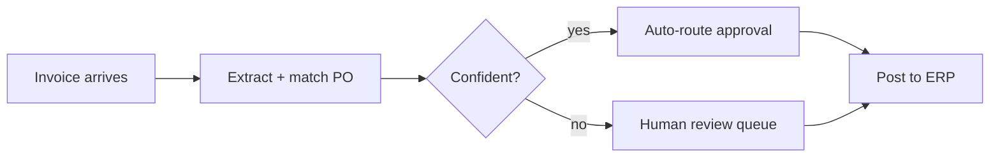

# NumeraPay

Accounts payable on autopilot for mid-market finance teams.

Series B · Demo Day 2026

---
layout: statement
---

## $2.1T moves through AP every year.

### Most of it is still typed in by hand.

---

## The problem

Finance teams at 50–500 person companies drown in invoices:

- **3–5 days** average time to approve a single invoice
- **62%** of AP staff time spent on data entry and chasing approvals
- **1.6%** of invoices paid late or twice — pure margin leakage
- ERPs (NetSuite, Sage) assume the data is *already* clean

> The bottleneck isn't payment rails. It's everything before the payment.

---

## The solution

NumeraPay reads the invoice, routes the approval, and books the entry — so the
team only touches the exceptions.

---

## How it works

1. **Capture** — email, PDF, or supplier portal; OCR + line-item parse
2. **Match** — three-way match against PO + receipt, flag the deltas
3. **Route** — policy-driven approval chains (amount, cost center, vendor)
4. **Sync** — write-back to NetSuite / Sage / QuickBooks with full audit trail

No rip-and-replace: NumeraPay sits *in front of* the ERP the team already has.

---
layout: two-cols
---

## Traction

- **$5.1M ARR**, up from $1.4M a year ago
- **33% MoM** new-logo growth, 6 months running
- **142 customers** · median 110 employees
- **Net revenue retention 128%**
- **NPS 48**

::right::

## What they say

> "We closed the books two days early for the first time in company history."
>
> — Controller, Series-C logistics co.

> "It paid for itself in caught duplicate payments inside a quarter."
>
> — VP Finance, regional healthcare group

---

## Business model

| Plan | Seats | Invoices/mo | Price |
|------|-------|-------------|-------|
| Team | up to 10 | 1,000 | $499/mo |
| Growth | up to 40 | 5,000 | $1,900/mo |
| Scale | unlimited | 20,000+ | custom |

Land with a single AP team, expand to procurement and spend controls.
Gross margin **82%**.

---

## Market

- **$9.4B** AP automation TAM, growing 11% a year
- Mid-market (50–500 employees) is **underserved** — too complex for
  consumer tools, too small for enterprise suites
- Wedge: invoice intake → expand into the full spend stack

---

## Why now

- LLM-grade extraction finally beats template-based OCR on messy invoices
- ERPs opened real write-back APIs in the last 24 months
- Remote finance teams need approvals that don't live in someone's inbox

---
layout: two-cols
---

## Team

- **Dana Okafor** — CEO. Ex-Head of Finance Ops, scaled a 12-person AP team.
- **Sam Reyes** — CTO. Built document pipelines at a top OCR vendor.
- **Priya Venkat** — VP Product. 8 years in fintech workflow tooling.

::right::

## The ask

# $8M Series B

- 18 months runway to $20M ARR
- 60% go-to-market, 30% ML + integrations, 10% G&A
- Lead identified; closing the round by Q3

---
layout: center
class: text-center
---

# Let's close the books early.

dana@numerapay.example · numerapay.example
