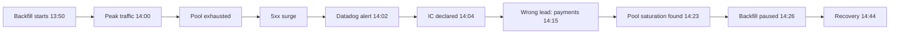

# INC-2026-04-19

## Checkout 5xx surge — blameless postmortem

Brightwell Commerce · Reliability Engineering

Severity P0 · 42 min customer impact · Reviewed 2026-04-26

---
layout: statement
---

## For 42 minutes, one in three checkouts failed.

### Nobody on the team did anything wrong. The system let them.

---

## At a glance

| | |
|---|---|
| **Incident** | INC-2026-04-19 |
| **Severity** | P0 (revenue-impacting, customer-facing) |
| **Detected** | 2026-04-19 14:02 UTC (Datadog auto-alert) |
| **Resolved** | 2026-04-19 14:44 UTC |
| **Customer impact** | 42 minutes, ~31% of checkout requests returned 5xx |
| **Requests lost** | ~1.2M (failed or shed) |
| **Incident commander** | Priya Nadeau (SRE) |
| **Author** | Reliability Engineering · published 2026-04-26 |

> This document is **blameless**. We name systems and decisions, never people-at-fault.

---
layout: section
---

# What happened

A routine catalog backfill ran during peak traffic and exhausted the
checkout service's database connection pool.

---

## Impact

- **Customers** — ~31% of `POST /checkout` requests returned `503` for 42 minutes
- **Orders** — ~1.2M requests shed; ~18,400 carts abandoned at the pay step
- **Revenue** — ~$214k in delayed/abandoned GMV; ~$31k estimated net loss after retries
- **Contractual** — 3 enterprise merchants breached their 99.9% monthly SLA
- **Trust** — 41 support tickets, 2 escalations to named CSMs, NPS -4 pts WoW

Status page was updated at 14:11, 9 minutes after detection.

---

## Timeline (UTC)

| Time | Event |
|------|-------|
| 13:50 | Catalog backfill job `reindex-suppliers` started by scheduled cron |
| 14:00 | Daily traffic peak begins (US East morning) |
| 14:02 | Datadog fires: `checkout 5xx rate > 5%` |
| 14:04 | On-call (Priya) acknowledges, declares incident |
| 14:08 | Incident channel `#inc-2026-04-19` opened, 4 responders join |
| 14:11 | Public status page set to **Degraded** |
| 14:15 | First wrong hypothesis: upstream payment provider (ruled out 14:21) |
| 14:23 | Connection-pool saturation identified in `checkout-api` dashboards |
| 14:26 | Backfill job `reindex-suppliers` paused |
| 14:31 | Pool recovers below 70%; 5xx rate begins dropping |
| 14:38 | Error rate back under alert threshold |
| 14:44 | Full recovery confirmed; status page set to **Operational** |
| 14:52 | Incident closed; retro scheduled |

---

## Detection & response

**Time to detect:** 2 min · **Time to mitigate:** 24 min · **Time to resolve:** 42 min

---
layout: two-cols
---

# Root cause — 5 Whys

::default::

1. Why did checkout return 5xx?
   **The DB connection pool was exhausted.**
2. Why was it exhausted?
   **The 100-connection ceiling was hit and held.**
3. Why was the ceiling hit?
   **A backfill opened long-lived connections during peak.**
4. Why did the backfill run at peak?
   **Its cron had no traffic-aware scheduling window.**
5. Why was there no window?
   **The migration playbook never required one.**

::right::

# Root cause

The failure was **latent in process, not in code**.

The backfill, the pool size, and the traffic peak were each individually fine.

The system had **no guardrail** preventing them from colliding — and the
playbook never asked anyone to check.

> Fix the guardrail, not the engineer who pressed go.

---

## Contributing factors

- **No pool-utilization alerting** — we alerted on the *symptom* (5xx) instead of
  the *leading indicator* (pool > 80%). We lost ~10 minutes confirming the cause.
- **Backfills share the production pool** — batch and interactive traffic compete
  for the same 100 connections; no isolation, no priority.
- **Cron has no traffic window** — `reindex-suppliers` can start at any hour,
  including the daily peak.
- **Misleading first signal** — payment-provider latency rose *as a consequence*
  of the backlog, sending responders down a dead-end hypothesis for 8 minutes.
- **Status page is manual** — the 9-minute delay to "Degraded" was a human step.

---

## What went well

- **Detection was fast** — automated alert fired in 2 minutes, no human noticed first.
- **IC role was clear** — a single commander was declared within 2 minutes of ack.
- **Clean rollback path** — pausing one job (not a deploy revert) mitigated safely.
- **No data loss** — every shed request was idempotent; retried carts recovered.
- **Calm comms** — the incident channel stayed focused; no thrash, no blame.

---

## Action items

| # | Action | Type | Owner | Due |
|---|--------|------|-------|-----|
| 1 | Alert on pool utilization > 80% (leading indicator) | Detect | Priya · SRE | 2026-05-03 |
| 2 | Give batch jobs a dedicated DB pool, capped + isolated | Prevent | Marco · Backend | 2026-05-12 |
| 3 | Add traffic-window gating to all backfill crons | Prevent | Lena · Platform | 2026-05-12 |
| 4 | Auto-publish status page from alert webhook | Mitigate | Ravi · SRE | 2026-05-17 |
| 5 | Add chaos test: pool exhaustion under load | Verify | Priya · SRE | 2026-05-31 |
| 6 | Playbook: "is it safe to run at peak?" pre-flight check | Process | Lena · Platform | 2026-05-10 |

Each item has a tracked ticket; #1 and #6 are committed for the next sprint.

---

## Lessons

- **Alert on causes, not symptoms.** A 5xx alert tells you something broke; a
  pool-saturation alert tells you *what* — and buys back the 10 minutes we lost.
- **Shared resources are coupled risk.** Batch and checkout fought over one pool;
  isolation would have contained the blast radius to the backfill alone.
- **Blameless means structural.** No human error caused this. Six guardrails were
  missing. We fix the guardrails so the *next* engineer can't trip the same wire.

---
layout: center
class: text-center
---

# Closed · ready to verify

Action items tracked in `#inc-2026-04-19` · re-review after item #5 ships

Brightwell Commerce · Reliability Engineering

