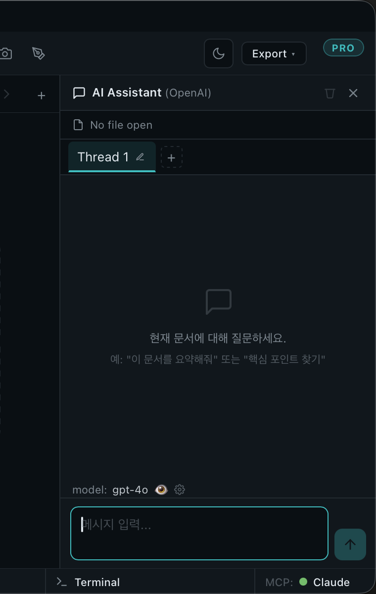

# AI Assistant

> Bring Your Own Model. The right pane is a chat surface that calls *your* AI provider — never ours.

## Open and close

⌘I toggles the AI Assistant on the right side. First-launch you'll see a 5-card guided setup. After that ⌘I is just a panel toggle.

## Provider presets

HTMLook ships 8 one-click presets:

| Provider | Best for |
|---|---|
| OpenAI | Most capable, broad model lineup |
| DeepSeek | Cheap, fast, strong reasoning models |
| Mistral | EU-hosted, strong French + English |
| Together | Hosted open models with broad selection |
| Groq | Lowest-latency inference, Llama family |
| Cerebras | Very fast Llama / Qwen inference |
| Ollama | Local, no key needed |
| Custom | Any OpenAI-compatible URL |

Pick one, paste your API key, choose a default model, done.

## What's in the panel

- Top — settings gear + history drawer
- Above the conversation — chips for the extensions HTMLook thinks are relevant to your current workspace + file
- The conversation itself — your messages, the assistant's, and any actions it took on the workspace inline
- Bottom — the input box with a 📎 button for attachments

## Asking it to do things

Type as you would in any chat. The assistant has read access to the workspace and can:

- Read the current file
- Open another file in a new tab
- Edit a file in place (with confirmation the first time)
- Create a new file
- Capture what's on screen
- Use any extension you've enabled

The first time the assistant tries to *change* something in a workspace, HTMLook shows a 4-button consent modal:

- **Yes, once** — allow this one change
- **Yes, this workspace** — remember the answer for this workspace
- **Yes, all workspaces** — global allow
- **No**

You can revoke at any time in *Settings → AI*.

## Attachments

The 📎 button (or drag onto the input box) attaches:

- Image (`.png`, `.jpg`, …)
- The current Paint canvas
- A PDF page (via *Send page to AI* in the PDF viewer)
- A workspace file (text-like)

The badge above the input shows the per-message attachment count.

## Chat history

Stored per workspace under `.htmlook/`. The history drawer lets you reopen, pin, or delete past threads. Threads export as markdown.

## Cancel + retry

Hit ⌘. to cancel a streaming response. The last user turn keeps a *Retry* affordance for one re-run.

## Privacy

Outbound only to the provider you configured. The system prompt, your message, and any file excerpts you reference form the call. HTMLook never proxies through a Deep-On server.

## Next

- [Extensions →](Skills.md)
- [Settings →](Settings.md)
