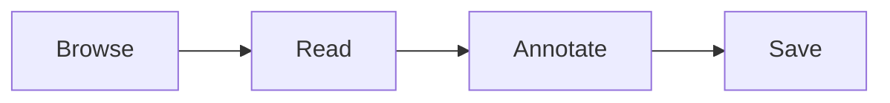

# 확장 (Extensions)

> 파일 열기 외에 HTMLook 이 할 수 있는 것들 — 다이어그램, 슬라이드 덱, 스마트 export — 와 사용법.

HTMLook 은 작은 *확장* 세트를 기본 탑재하고, 추가로 더 넣을 수 있게 합니다. 대부분은 그냥 *동작* 합니다 — 설치/설정 안 하고 타이핑하면 그 결과가 나옴. 일부는 새 export 포맷이나 코드블록 렌더러를 활성화.

## 빌트인 (이미 켜져 있음, 타이핑만)

### Mermaid 다이어그램

`mermaid` 태그의 fenced 코드블록을 입력하면 에디터가 라이브 렌더:

````markdown

````

`mmd` 태그로도 동작.

### D2 다이어그램

같은 발상, 다른 문법:

````markdown
```d2
direction: right
a -> b -> c
```
````

### Smart Markdown (export)

Export → **Markdown (Smart)** 선택 시 HTMLook 이 polish pass 실행 — footnote 복원, 테이블 정리, 잉여 공백 제거. 다른 도구로 파일 옮길 때 유용.

### 슬라이드 덱 (export)

마크다운의 Heading 1 이 슬라이드 제목. Export → **슬라이드 덱** 으로 `.pptx` 생성.

## 더 발견

사이드바의 **Extensions** 패널이 활성 확장과 색 dot 표시:

- 진한 색 — 확장이 설치되고 감지됨
- 흐린 ring — 확장 자체는 HTMLook 안에 있지만 의존하는 외부 도구 (예: `.pptx` 위한 LibreOffice) 가 컴퓨터에 아직 없음. dot 클릭하면 설치 (Homebrew 가 진행 모달과 함께 처리)

확장은 다른 설정과 함께 **Settings → Tools** 에. 같은 패널에 **+ Add** 버튼이 있어 직접 만든 것 떨어뜨리기 가능.

## 직접 추가하기

워크스페이스의 `.claude/skills/` 폴더에 원하는 동작을 묘사한 markdown 파일을 떨어뜨리면 HTMLook 이 AI 대화 중 호출 가능한 확장으로 인식. 이건 고급 워크플로우 — 대부분 사용자는 필요 없음. 기존 컬렉션을 가져오거나 직접 만들고 싶으면 **Settings → Tools → + Add**.

## 다음

- [Export →](Export-ko.md)
- [Settings →](Settings-ko.md)
