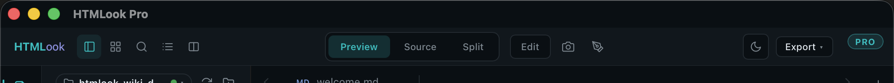

# 탭과 보기 모드

> 탭은 여러 파일을 동시에 열어두는 방식. 보기 모드는 한 탭의 화면 배치.

## 파일을 탭으로 열기

| 방법 | 트리거 |
|---|---|
| 사이드바 단일 클릭 | 현재 탭 교체 |
| 사이드바 더블 클릭 | 새 탭 |
| ⌘+클릭 | 백그라운드 탭으로 |
| Finder → 윈도우 드래그 | 새 탭 |
| 뷰어 안 `htmlook://` 링크 | 기존 탭 재사용 또는 새 탭 |
| ⌘O / ⌘⇧O | OS open dialog (폴더 / 파일) |

## 탭 스트립 동작

- ⌘⌥1..9 로 탭 1..9 점프
- ⌘W 활성 탭 닫기 (수정 시 확인)
- ⌘⇧T 마지막에 닫은 탭 다시 열기
- ⌘⌥→ 다음, ⌘⌥← 이전
- 가운데 클릭 닫기
- 가로 드래그로 순서 변경
- 탭을 strip 밖으로 드래그 → 새 윈도우로 tear-out
- ● 미저장 변경
- 터미널 탭은 letter mark (Cl/Cx/Gm/Sh). 출력 stream 중에 부드러운 애니메이션

### 탭 우클릭 메뉴

- *Pin / Unpin* — 핀 고정 탭은 "모두 닫기" 에서 살아남음
- *다른 탭 닫기*, *오른쪽 닫기*, *모두 닫기*
- *Finder 에서 표시*
- *경로 복사*, *상대 경로 복사*
- *터미널에서 열기* (다음 비어있는 터미널 탭에서 파일 디렉토리로 chdir)

## 보기 모드 (활성 탭 단위)

### Preview · ⌘1
파일을 렌더. 읽기 가능한 모든 것의 기본 (Markdown 렌더, PDF 그대로, 비디오 재생 등).

### Source · ⌘2
원본 소스 — Markdown 텍스트, HTML 마크업, JSON 텍스트 등. 여기서 편집하면 파일에 쓰기.

### Split · ⌘3
왼쪽 preview, 오른쪽 source. 툴바의 **Sync scroll** 토글로 세로 위치 잠금.

### Gallery · ⌘G
워크스페이스 파일의 thumbnail grid. thumbnail 클릭으로 오픈.

### Paint (Pro) · ⌘⌥P
뷰어 위 투명 스케치 캔버스. [Paint](Paint-ko.md) 참조.

### Present
chrome (사이드바 · 탭 · 상태바) 숨김. *View → Present mode*. ⎋ 로 종료.

## 저장 모델

Markdown / HTML 탭은 마지막 키 입력 1.5 s 후 자동 저장. 상태바에 보류 중 `●`, 커밋 후 `✓`. ⌘S 로 즉시 저장.

미저장 (Untitled) 탭은 자동 저장 안 함 — ⌘S 시 저장 위치 묻습니다.

## 마지막 세션 복원

HTMLook 이 launch 시 워크스페이스별 마지막 탭 셋 복원 가능. Settings → General → *On launch* → *마지막 세션 복원* (기본) 또는 *빈 상태 시작*.

## 다음

- [사이드바 →](Sidebar-ko.md)
- [뷰어 →](Viewer-ko.md)
