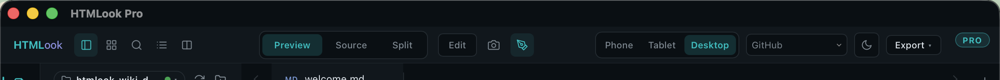

# 탭과 보기 모드

> 탭은 여러 파일을 동시에 열어두는 방식. 보기 모드는 한 탭의 화면 배치.

## 파일을 탭으로 열기

| 방법 | 트리거 |
|---|---|
| 사이드바 단일 클릭 | 현재 탭 교체 |
| 사이드바 더블 클릭 | 새 탭 |
| ⌘+클릭 | 백그라운드 탭으로 |
| Finder → 윈도우 드래그 | 새 탭 |
| 뷰어 안 `htmlook://` 링크 | 기존 탭 재사용 또는 새 탭 |
| ⌘O / ⌘⇧O | OS open dialog (폴더 / 파일) |

## 탭 스트립 동작

- ⌘⌥1..9 로 탭 1..9 점프
- ⌘W 활성 탭 닫기 (수정 시 확인)
- ⌘⇧T 마지막에 닫은 탭 다시 열기
- ⌘⌥→ 다음, ⌘⌥← 이전
- 가운데 클릭 닫기
- 가로 드래그로 순서 변경
- 탭을 strip 밖으로 드래그 → 새 윈도우로 tear-out
- ● 미저장 변경
- 터미널 탭은 letter mark (Cl/Cx/Gm/Sh). 출력 stream 중에 부드러운 애니메이션

### 탭 우클릭 메뉴

- *Pin / Unpin* — 핀 고정 탭은 "모두 닫기" 에서 살아남음
- *다른 탭 닫기*, *오른쪽 닫기*, *모두 닫기*
- *Finder 에서 표시*
- *경로 복사*, *상대 경로 복사*
- *터미널에서 열기* (다음 비어있는 터미널 탭에서 파일 디렉토리로 chdir)

## 보기 모드 (활성 탭 단위)

### Preview · ⌘1
파일을 렌더. 읽기 가능한 모든 것의 기본 (Markdown 렌더, PDF 그대로, 비디오 재생 등).

### Source · ⌘2
원본 소스 — Markdown 텍스트, HTML 마크업, JSON 텍스트 등. 여기서 편집하면 파일에 쓰기.

### Split · ⌘3
왼쪽 preview, 오른쪽 source. 툴바의 **Sync scroll** 토글로 세로 위치 잠금.

### Gallery · ⌘G
워크스페이스 파일의 thumbnail grid. thumbnail 클릭으로 오픈.

### Paint (Pro) · ⌘⌥P
뷰어 위 투명 스케치 캔버스. [Paint](Paint-ko.md) 참조.

### Present
chrome (사이드바 · 탭 · 상태바) 숨김. *View → Present mode*. ⎋ 로 종료.

## 저장 모델

Markdown / HTML 탭은 마지막 키 입력 1.5 s 후 자동 저장. 상태바에 보류 중 `●`, 커밋 후 `✓`. ⌘S 로 즉시 저장.

미저장 (Untitled) 탭은 자동 저장 안 함 — ⌘S 시 저장 위치 묻습니다.

## 마지막 세션 복원

HTMLook 이 launch 시 워크스페이스별 마지막 탭 셋 복원 가능. Settings → General → *On launch* → *마지막 세션 복원* (기본) 또는 *빈 상태 시작*.

## 멀티 윈도우 탭 모드 (v1.0.14+)

두 단계의 탭이 공존합니다:

- **파일 탭** (위 내용) — 한 윈도우 안의 파일별 탭.
- **윈도우 탭** — 툴바 위쪽의 Chrome 스타일 strip. 각 탭이 *워크스페이스 한 개*.

**Settings → General → Window tabs → Tab mode** 를 켭니다. 열린 모든 Pro 윈도우가 포커스된 윈도우의 rect 로 정렬되고, 그 후로 드래그 / 리사이즈 / +Add 가 peer 들에게 전파됩니다.

### 윈도우 탭 strip

- 툴바 위에 위치.
- 가로로 드래그해서 **순서 변경**. 탭이 어디에 놓일지 삽입 gap 으로 표시.
- 오른쪽 클릭으로 *Focus · Move-out · Close*.
- Hover 하면 전체 워크스페이스 경로가 적힌 preview 카드.
- **Color tabs** 가 켜져 있으면 (Settings → General) 각 탭이 워크스페이스에서 파생된 hue 로 칠해집니다.

### 단축키

| 동작 | 단축키 |
|---|---|
| N 번째 윈도우로 점프 | `⌘⌃1` … `⌘⌃9` |
| 다음 윈도우 cycle | `⌘⌃`` |
| 윈도우 여기에 쌓기 (포커스된 rect 로 모두) | `⌘⌃S` |
| 빈 워크스페이스 윈도우 추가 | strip 의 `+` 버튼 |

### Move-out (↗)

탭 오른쪽 클릭 → *Move-out* — 윈도우가 현재 rect 에서 +60 / +60 px 만큼 이동해 stack 에서 시각적으로 분리됩니다. 한 워크스페이스만 옆에 두고 싶을 때.

### 저장된 레이아웃

현재 윈도우 셋 (rect + color 포함) 을 이름 붙여 저장: **Settings → General → Window tabs → Save current layout**. 같은 패널에서 복원. 복원 시 *Layout restore* 모드 (*Exact* — 같은 rect, 또는 *Cascade 30 px* — anchor 에서 부채꼴로 펼침) 를 존중합니다.

### Tab mode 끄기

토글 해제 시 윈도우들이 60 px 간격으로 자동 cascade 되어 시각적으로 분리됩니다 (수동 드래그 불필요).

## 다음

- [사이드바 →](Sidebar-ko.md)
- [뷰어 →](Viewer-ko.md)
