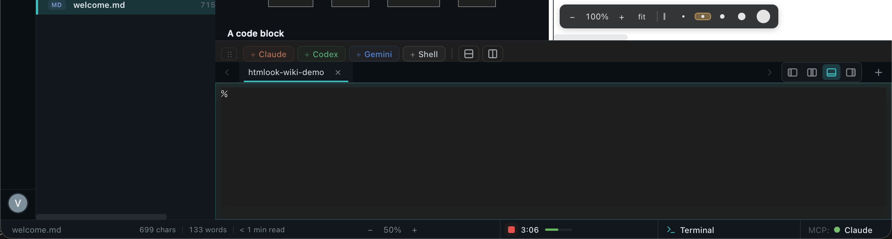

# 터미널

> 앱 안의 진짜 터미널. AI 어시스턴트 (Claude / Codex / Gemini) 가 같은 워크스페이스에 *함께* 앉도록 설계.

## 토글과 docking

| 동작 | 단축키 |
|---|---|
| 터미널 표시 / 숨김 | ⌘J |
| 현재 preset 으로 새 탭 | ⌘T |
| 활성 탭 닫기 | ⌘W (터미널 포커스 시) |
| 탭 순환 | ⌃⇥ / ⌃⇧⇥ |
| 활성 pane 상하 split | ⌘D |
| 활성 pane 좌우 split | ⌘⇧D |
| dock 위치 순환 (bottom / right / left / center) | Activity Bar 아이콘, 또는 grip 드래그 |

패널 안쪽 가장자리의 드래그 핸들로 크기 조절.

## Preset (네 개의 "+" 버튼)

preset 툴바가 특정 CLI 로 실행되는 새 탭을 엽니다:

| Preset | 명령 | Letter mark |
|---|---|---|
| Claude | `claude` | **Cl** |
| Codex | `codex` | **Cx** |
| Gemini | `gemini` | **Gm** |
| Shell | (`$SHELL`, 기본 `zsh`) | **Sh** |

탭에 letter mark 가 표시되고 출력이 stream 중일 때 애니메이션. 실행 명령은 *Settings → Terminal → Preset commands* 에서 편집.

폭이 좁아지면 툴바 collapse: 버튼 라벨 사라지고 brand letter mark 만 남음.

## "Save as preset" — 책갈피 아이콘 버튼

터미널 탭에서 유용한 one-shot 프롬프트를 입력한 다음 (예: "마지막 테스트 출력 요약 + fix 제안") 책갈피 아이콘을 누르면 저장. 같은 프롬프트를 한 클릭에 활성 터미널로 paste 하는 새 버튼이 preset 툴바에 생성.

워크스페이스의 `.htmlook/` 에 저장.

## 한글 IME

한글 조합이 예상대로 동작합니다 — `다` 입력 시 `다` 가 나오고 `ㄷㅏ` 가 아님. IME 모드 전환 직후도 마찬가지. 조합 중 pre-edit 가 제 자리에 표시. 회귀가 보이면 `IME_DEBUG=true` 로그 (Settings → Terminal) 캡쳐해서 알려주세요.

## Pane 관리

각 탭이 Tmux 스타일 grid 로 최대 **6 pane**. ⌘D / ⌘⇧D 로 split. 활성 pane 은 살짝 밝은 border. 클릭으로 포커스. `Cmd+[` / `Cmd+]` 로 순환.

## 탭의 프로세스 트리

터미널이 각 탭에서 무엇이 실행 중인지 (`claude` · `codex` · `gemini` · 일반 셸) 추적하고 letter mark 에 반영. AI 가 출력 생성 중일 때 mark 가 부드럽게 pulse.

## OSC 7 cwd

셸이 OSC 7 emit 하면 (`bash` auto, `zsh` 은 `.zshrc` 에 snippet 추가) 탭 제목에 압축된 cwd (예: `~/W/htmlook`). brand letter mark 는 제목 왼쪽 유지.

## 선택을 터미널로 보내기

뷰어에서 텍스트 하이라이트 → ⌘⌥⇧T (또는 *View → Send Selection to Terminal*) → 활성 터미널 pane 에 paste. 문서의 "이 명령 실행" 같은 코드 샘플에 유용.

## 컨텍스트 메뉴

터미널 어디든 우클릭 — *복사* / *붙여넣기* / *전체 선택* / *스크롤백 지우기* / *터미널 리셋* / *탭 이름 변경* / *새 윈도우로 이동*.

## 영속화 — tmux 백엔드 (v1.0.14+)

이제 터미널은 raw PTY 소유가 아니라 **tmux** 가 받칩니다. 세션이 앱 프로세스보다 오래 삽니다: HTMLook 닫고 다시 열면 같은 scrollback 자리에 떨어집니다.

**Settings → Terminal → Persistence → tmux** 로 켭니다. (이전 *visual buffer* 모드도 그대로 — 셸은 살리지 않고 렌더링된 출력만 복원.)

### tmux 모드가 주는 것

- **그 자리에 reattach** — 앱 닫고 다시 열면 각 pane 의 scrollback 이 그대로. 탭 라벨은 *실제* 포그라운드 프로세스 (`claude`, `codex`, 셸) 를 반영, HTMLook 의 추측이 아닌.
- **Preset 자동 resume** — Claude / Codex preset 으로 만든 탭이 워크스페이스에 기존 세션이 있으면 silent 하게 `--continue --fork-session` 으로 이어받음.
- **Pane 별 안정 이름** — tmux 세션 명명은 `htmlook-<sha8>-tab<N>-pane<M>`, sha8 은 NFC 정규화된 워크스페이스 path. 재시작 / APFS NFD/NFC quirks 모두 deterministic.

### 버퍼 내 검색

`⌘F` 로 활성 pane 안의 검색 오버레이. hit counter `M of N`; `↵` 다음, `⇧↵` 이전, `⎋` 닫기.

### Pane 간 입력 동기화

Pane 헤더 ⌃ 클릭으로 컨텍스트 메뉴 → *Sync input with…* → 다른 pane 선택. 동기화 그룹의 모든 pane 에 초록 띠 표시. 한 번 타이핑하면 모든 pane 이 키 입력 받음. 세 레포에서 `git pull` 동시 실행 같은 경우 유용.

### Pane 드래그-swap

Pane 헤더를 다른 pane 헤더 위로 드래그해 위치 교환. cursor-based 드래그 + snapshot centers — HTML5 drop interception 문제 없음.

### Pane 을 새 윈도우로 detach

포커스된 pane 에서 `⌘D` (터미널이 포커스일 때) 또는 *Pane 컨텍스트 → Move to new window*. tmux 세션이 함께 이동 — 같은 scrollback, 같은 실행 중 명령어.

### 워크스페이스 tmux popover

ActivityBar 의 tmux 버튼이 machine 의 모든 htmlook tmux 세션 표시 — *This workspace* + *Other workspaces*. orphan 클릭으로 다시 attach; 살아있는 pane 행 클릭으로 현재 윈도우에서 포커스.

### 키보드 선택 모드

`⌃⇧K` 로 활성 pane 의 블록 선택 모드 진입:

| 키 | 동작 |
|---|---|
| 화살표 | 커서 이동 |
| Shift + 화살표 | 선택 확장 |
| Home / End / PgUp / PgDn | 줄 / 페이지 단위 이동 |
| `⌘C` | 선택 텍스트 복사 |
| `⎋` | 선택 모드 종료 |

(이전엔 `⌃⇧Space` 였으나 macOS Input Sources 가 가로채서 변경. v1.0.14 초기 버전에서 업그레이드 시 바인딩 자동 마이그레이션.)

### 탭 close → 왼쪽 이웃

가장 오른쪽 터미널 탭을 닫으면 포커스가 **왼쪽 이웃** 으로 이동, macOS Terminal / iTerm 과 일치. 이전엔 탭 0 으로 튀었음.

### 한글 cwd

한글 cwd (`/Users/you/Works/배터리진단`) 모든 pane 에서 정상 동작. v1.0.14 에서 `proc_pidinfo` 가 한글 path 에 empty 반환하고 `lsof` fallback 이 Tauri sync worker 를 wedge 시키던 freeze 버그를 fix.

## 다음

- [AI 어시스턴트 →](ChatPanel-BYOM-ko.md)
- [확장 (Extensions) →](Skills-ko.md)
