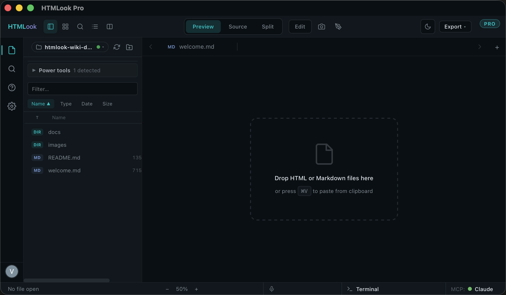

# UI Overview

> One layout, every pane named. Bookmark this page.

## The six surfaces

### 1. Activity Bar (far left, 32 px)
Quick toggles: file list visibility, view mode (preview / source / split / gallery), Paint, Present, terminal dock-position cycler. Hover gives a tooltip with the keyboard shortcut.

### 2. Sidebar
File tree of the current workspace + filter input + drag-out to Finder/Mail/Slack, multi-select (⌘+click / ⇧+click), context-menu (rename, duplicate, reveal in Finder, open in terminal, delete N). Top dropdown switches between recently-opened workspaces.

→ Full page: [Sidebar](Sidebar.md)

### 3. Tabs strip
Open files become tabs. ⌘⌥1..9 jumps. ⌘W closes. The modified dot (●) appears when unsaved. Right-click tab for *Pin*, *Close others*, *Reveal in Finder*, *Copy path*. Terminal tabs show a brand letter mark (Cl/Cx/Gm/Sh).

### 4. Viewer (centre, the biggest area)
Renders the active tab. The renderer switches automatically:

- `.md` → WYSIWYG Markdown editor with autocorrect, ⌘K link dialog, ⌘B/I/U inline formatting, code-block language picker, image popover (alt + align)
- `.html` → iframe sandbox with relative-asset inlining
- `.pdf` → PDF.js with text-layer + highlight tool
- video / audio → custom player with bookmarks + transcript
- everything else → either pretty render or syntax-highlighted code

Dual-view (split = ⌘3) shows two files side-by-side. Present mode hides chrome.

→ Full page: [Viewer · Markdown Editor](Viewer.md)

### 5. Terminal panel
Dockable bottom / right / left / centre. Each tab is a real terminal (zsh by default) with optional preset (Claude / Codex / Gemini / Shell). ⌘J toggles visibility. ⌘T new tab. ⌘D / ⌘⇧D split panes.

→ Full page: [Terminal](Terminal.md)

### 6. AI Assistant
Bring-Your-Own-Model chat. ⌘I toggles. 4-button consent modal the first time the assistant tries to change something in a workspace.

→ Full page: [AI Assistant](ChatPanel-BYOM.md)

## Layered surfaces

- **Find bar**: ⌘F inside the viewer. ⌘G next match.
- **Paint canvas**: ⌘⌥P toggle. Pen / shapes / arrow / text, undo 50 steps, PNG export.
- **Voice player**: appears at the bottom when a `.m4a` is selected. Multi-memo navigation, transcript view, waveform.
- **Update notifier**: top-right corner when a newer build is available.

## View modes

| Mode | Shortcut | What it does |
|---|---|---|
| Preview | ⌘1 | Default — rendered output |
| Source | ⌘2 | Raw source |
| Split | ⌘3 | Preview + source side-by-side |
| Gallery | ⌘G | Thumbnail grid of the workspace's files |
| Paint | ⌘⌥P | Sketch on top of the viewer |
| Present | View menu | Hide chrome, fullscreen the viewer |

## What you tweak in [Settings](Settings.md)

Theme · font · terminal preset commands · AI provider/key · default sort · per-language code preferences · viewer print header/footer.

## Next

- [Tabs & Views →](Tabs-and-Views.md)
- [Sidebar →](Sidebar.md)
