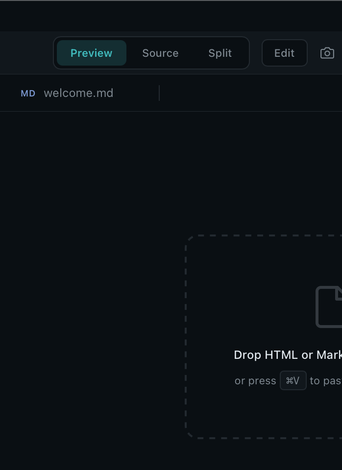

# 뷰어 · 마크다운 에디터

> 가장 큰 영역. 파일 타입별 렌더러 + Pro 의 마크다운 풀 WYSIWYG.



## 파일 타입별 렌더러

| 타입 | 렌더러 | 편집 가능? |
|---|---|---|
| `.md` `.markdown` `.mdx` | WYSIWYG 마크다운 에디터 | 예 — Pro 풀, Easier 는 read-only |
| `.html` `.htm` | Self-contained iframe (상대 asset 인라인) | 보기 (Source 뷰로 raw HTML 편집) |
| `.qmd` | Quarto 렌더 → iframe | 보기 |
| `.pdf` | PDF 렌더러 + text layer | Pro 에서 하이라이트/코멘트 |
| `.docx` `.pptx` `.xlsx` | LibreOffice → PDF → 렌더 | 보기 |
| `.svg` | 인라인 렌더 | Source 뷰에서 편집 |
| `.json` `.csv` `.tsv` | 표 + 트리 뷰 | 보기 |
| 이미지 | 네이티브 뷰어 + zoom · fit · pan | — |
| 비디오 | 자체 플레이어 (아래) | — |
| 오디오 (`.m4a` 등) | Generic file fallback ("Preview not available"). 음성 메모는 **문서 기반 Voice Player** drawer 로 재생 — [음성 메모](Voice-Memos-ko.md) 참조. | — |
| 소스 코드 | syntax-highlighted | Source 뷰에서 편집 |
| 미지정 | hex / text fallback | — |

## Markdown WYSIWYG (Pro)

에디터가 마크다운을 *렌더* 하지만 *렌더 위에서 타이핑*. 일반 워드프로세서처럼 느껴지지만 출력은 깨끗한 마크다운.

### 블록 autocorrect

| 입력 | 결과 |
|---|---|
| `# ` | H1 |
| `## ` … `###### ` | H2 .. H6 |
| `> ` | Blockquote |
| ```` ``` ```` + Enter | Fenced code (Tab 으로 언어 순환) |
| `--- ` + Enter | 수평선 |
| `- [ ] ` | Task list (미체크) |
| `- [x] ` | Task list (체크) |

### 인라인 autocorrect

닫는 delimiter 가 포맷팅으로 변환:
`**bold**`, `*em*`, `_em_`, `` `code` ``, `~~strike~~`, `~sub~`, `^sup^`.

### 선택 wrap

텍스트 선택 후 `*` `_` `` ` `` 누르면 감쌈. `[` `(` `{` `'` `"` 누르면 양쪽 감싸고 안쪽 재선택.

### 공학 기호

코드블록 밖에서 `-> <- => <-> <=> >= <= != +-` 가 `→ ← ⇒ ↔ ⇔ ≥ ≤ ≠ ±` 으로.

### 링크 — ⌘K

선택 인식 링크 다이얼로그. 선택 있으면 텍스트 prefill. caret 이 `<a>` 안이면 URL 편집 또는 *Remove*. 아니면 새 삽입. `[text](url.md)` autocorrect 도 동작.

### 코드블록

caret 이 fenced 안 → 우상단 **언어 picker**. 큐레이션 리스트 또는 직접 타이핑. ```` ```python ```` 로 round-trip. 확장이 등록한 모든 언어가 picker 에 자동 등장.

### 이미지

이미지 선택 → *alt text* + *정렬* (left / center / right / none) popover. 정렬은 인라인 style 작성 → 마크다운 저장/로드 round-trip.

### Footnote

`[^id]: body…` 정의, `[^id]` 참조. 에디터가 번호 다시 매기고 마지막에 `Footnotes` 섹션 자동 렌더. 저장/로드 round-trip.

### Paste

⌘V 가 이미지 → HTML (sanitize — Word 의 잡동사니 제거) → 텍스트 순서. ⌘⇧V 는 항상 plain.

### 자동 저장

마지막 키 입력 1.5 s 후 저장. Untitled 탭은 자동 저장 안 함, ⌘S 시 저장 위치 묻기.

### 인쇄 / PDF 머리/꼬리말

*Settings → Viewer → Print header / Print footer* 가 토큰 `{filename}` · `{date}` · `{page}` · `{pages}` 지원. 빈 문자열이면 그 줄 미출력.

## PDF 뷰어

continuous scroll · 툴바 zoom · *Find in PDF* (⌘F) · 색상 picker 가 있는 하이라이트 도구. 하이라이트는 PDF 옆에 영구 저장 — 파일 이동/공유 시 함께 이동. 코멘트는 하이라이트에 붙고 우측 마진에 표시.

## 비디오 / 오디오 플레이어

빌트인:

- 북마크 마커가 있는 스크러버
- 속도 컨트롤 (0.5× → 2×)
- *순간 마크* — 파일의 북마크 sidecar 에 추가
- transcript 패널 — transcript sidecar 가 있으면 등장
- seek bar 아래 챕터 strip
- AB-loop 범위 도구

## Find bar

⌘F 로 뷰어 내 찾기. ⏎ 다음, ⇧⏎ 이전, ⌘G 다음. 라이브 증분, regex 토글, 대소문자 토글. 닫으면 highlight 정리.

## 다음

- [터미널 →](Terminal-ko.md)
- [Export →](Export-ko.md)
