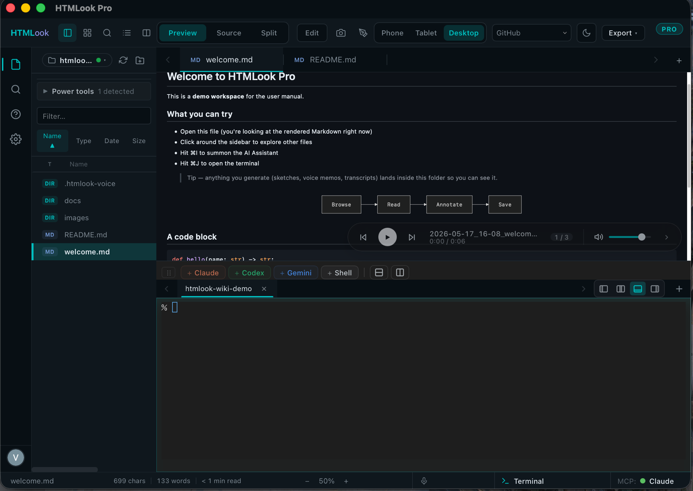

# Voice memos

> A microphone button in the status bar. AAC files saved next to your workspace. Optional transcripts.

## Recording

Bottom-right of the status bar: a microphone glyph. Click to start — the glyph turns red and a small audio-level bar appears next to it. Click again to stop. The file lands in `<workspace>/.htmlook-voice/` as `voice_<YYYYMMDD-HHMMSS>.m4a`.

First time, macOS will ask for microphone permission. The dialog explains the recording stays on your machine.

> On M3 + MacBook Pro with the lid closed (clamshell mode), the internal mic is digitally silent — a known macOS quirk. Open the lid or pair an external mic. HTMLook detects zero-amplitude streams and surfaces a one-time warning.

## Playback player

Voice memos are **doc-attached metadata** — the player is bound to the document, not to the audio file. When the active document has one or more memos linked to it (the link is established by recording while that document was open), a player strip is inlined inside the viewer alongside the rendered content.

- ◀ ▶▶ navigate memos attached to the active document; the badge shows `n / total`
- Memo filename + elapsed / total time (e.g. `0:00 / 0:06`)
- Volume slider on the right

**Clicking a `.m4a` directly in the sidebar does not open the player** — the viewer treats it as an unrecognised file type and shows a generic "Preview not available" card. To listen, open the document the memo was recorded against.

## Transcripts

A transcript is just a sibling file next to the memo — `<memo>.m4a.transcript.json`. When present, the player shows the transcript inline with timecodes; clicking a sentence seeks playback there.

To create one, ask your AI assistant ("transcribe this memo") and let it write the file — the assistant handles the rest. There's no built-in speech-to-text engine in the app itself; bring whichever you trust.

## Drag-out

Drag a memo from the sidebar into Finder, Mail, Slack, or Notion. The drop carries the .m4a path — drop into Mail to attach.

## Searching across memos

⌘⇧F (Find in workspace) covers voice transcripts too. Matches show up with the memo name and the timecode of the hit.

## Privacy

Voice files never leave the workspace folder on their own. Anything you do with them — transcribing, sending to a chat — is your explicit action. The mic glyph turns red while recording so you always know.

## Next

- [Extensions →](Skills.md)
- [Settings →](Settings.md)
